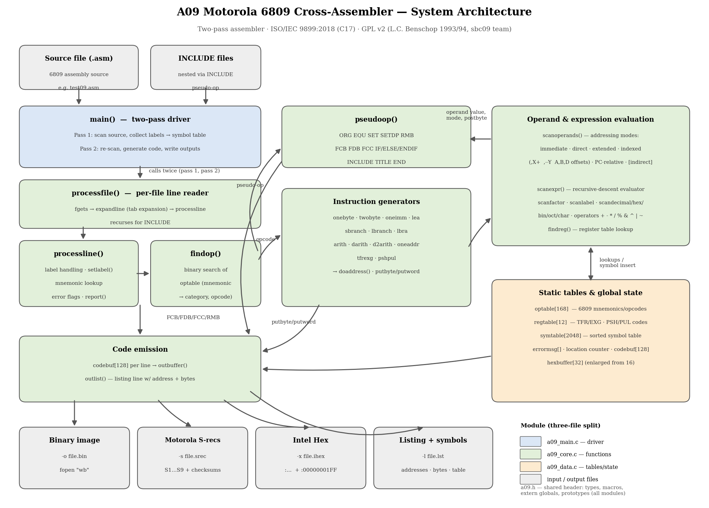

# a09 — Motorola 6809 Cross-Assembler, Modernized to C17


-blue)


A working restoration of a classic: **L.C. Benschop's 1993/94 two-pass 6809
cross-assembler**, reconstructed from source fragments, extended with Intel Hex
output, and brought up to the current **ISO/IEC 9899:2018 (C17)** standard —
compiling with **zero warnings** under `gcc -std=c17 -Wall -Wextra -pedantic`
on GCC 10 through 16, on both Windows (MinGW-w64) and Linux.

The project demonstrates a complete legacy-code modernization workflow:
provenance research, fragment reconstruction, standards remediation, a real
buffer-overflow fix, deliberate bug-for-bug preservation under change control,
and byte-identical verification between two build layouts.



A live [Mermaid version of this diagram](a09_system_architecture.md) is in the
architecture document.

---

## Features

- **Two-pass assembly** of Motorola 6809 source: pass 1 builds the symbol
  table (forward references supported), pass 2 generates code
- **Three output formats:** raw binary image (`-o`), Motorola S-records
  (`-s`), and Intel Hex (`-x`) — checksummed end records included
  (`S9030000FC` / `:00000001FF`)
- **Annotated listing** (`-l`) with per-line addresses, generated bytes, and a
  sorted symbol table
- **Full 6809 addressing-mode support:** immediate, direct, extended, indexed
  with pre-/post-increment/decrement (`,X+` `,--Y`), accumulator offsets
  (`A,` `B,` `D,`), PC-relative, and indirect (`[...]`)
- **Recursive-descent expression evaluator** with decimal, hex (`$`), binary
  (`%`), octal (`@`), and character (`'`) constants and C-style operators
- **Pseudo-ops:** `ORG EQU SET SETDP FCB FDB FCC RMB IF/ELSE/ENDIF INCLUDE
  TITLE END`
- Two equivalent source layouts producing **byte-identical output**

## Repository Layout

| File | Purpose |
|---|---|
| `a09.c` | Single-file build — the complete assembler in one translation unit |
| `a09.h` | Shared header for the split build: types, macros, extern globals, prototypes |
| `a09_data.c` | 168-entry opcode table, register table, symbol table, global state |
| `a09_core.c` | Scanner, expression evaluator, code generators, output writers |
| `a09_main.c` | `main()` — two-pass driver |
| `test09.asm` | 6809 test program (assembles to exactly 29 bytes) |
| `a09_system_architecture.md` | Architecture document with Mermaid diagram |
| `a09_system_diagram.png` | Rendered system diagram |

> Build **either** `a09.c` alone **or** the three split `.c` files together —
> never both, since every function would be defined twice.

## Building

Any C17-capable GCC works (verified on GCC 10.2 → 16.1). On Windows, the
[WinLibs MinGW-w64](https://winlibs.com) standalone build requires no
installer and no administrator rights.

```sh
# merged (single file)
gcc -std=c17 -Wall -Wextra -pedantic -o a09 a09.c

# split (three files + shared header)
gcc -std=c17 -Wall -Wextra -pedantic -o a09 a09_data.c a09_core.c a09_main.c
```

Both builds complete with zero warnings.

## Usage

```
a09 [-o objname | -s objname | -x objname] [-l listname] srcname
```

**Option order is fixed** (a preserved 1993 behavior): the output-format flag
comes first, then `-l`, then the source file last.

```sh
a09 -o test.bin -l test.lst test09.asm    # binary + listing
a09 -s test.srec test09.asm               # Motorola S-records
a09 -x test.ihex test09.asm               # Intel Hex
```

Sample listing output:

```
0100: 10CE0400        start   lds #$400
0104: C661                    ldb #'a
0106: 8E0114          loop    ldx #data
...
SYMBOL TABLE
      DATA 02 0114      LOOP 02 0106     LOOP2 02 010c     START 02 0100
```

The output is 6809 machine code — run it on an emulator such as the sbc09
project's `v09` simulator, [XRoar](https://www.6809.org.uk/xroar/), or MAME.

## The Modernization

The starting point was three source fragments (macros, function bodies, and
`main()`) extracted from a fork of the original assembler. The missing
structures, the full opcode table, and ~40 globals were recovered from the
original GPL v2 source in the [sbc09 repository](https://github.com/6809/sbc09)
and verified line-for-line against the fragments.

**C17 remediation applied:**

- Standard `#include`s and a complete prototype block — fixing implicit
  declarations of the recursive `scanexpr()` and mutually recursive
  `processfile()`/`pseudoop()`, which are hard errors on modern compilers
- `processfile()`: `int` with no return value (undefined behavior since C99)
  changed to `void`
- `main()`: `getchar()` result stored in `int` for correct EOF handling;
  `return 0` added
- Empty parameter lists `()` converted to `(void)` throughout
- `<ctype.h>` calls given `(unsigned char)` casts (UB on negative `char`)
- `RESOLVECAT` macro rewritten as a brace block — the original spliced a
  comment into the macro body via line continuation

**Real bug found and fixed:** the Intel Hex writer fills up to 32 bytes before
flushing, but the original buffer was declared `hexbuffer[16]` — a buffer
overflow on any record longer than 16 bytes. Enlarged to 32; the 29-byte test
record exercises exactly this path.

**Deliberately preserved, bug-for-bug and commented in place:** the missing
`break` after `case '|'` in `scanexpr()` (present in the 1993 original) and
the fixed option-parsing order. Behavior changes were limited to
standards-compliance and the overflow fix — everything else assembles exactly
as it did in 1994.

**Verification:** a test program covering immediate, indexed, and relative
addressing plus data pseudo-ops was assembled by both builds in all three
output formats; outputs were compared byte-for-byte and every S-record and
Intel Hex checksum was independently recomputed.

## Provenance & License

- Original: **a09** by **L.C. (Lennart) Benschop**, posted to Usenet
  `alt.sources`, 1993-11-03; copyleft 1994–2014 by the
  [sbc09 team](https://github.com/6809/sbc09)
- Intel Hex support originates from a later fork of that code
- License: **GNU General Public License v2** — this repository is a
  derivative work and retains the original attribution in every source file;
  see `LICENSE`

## Acknowledgments

Lennart Benschop, for a compact and readable assembler that still teaches
recursive-descent parsing three decades on, and the sbc09 maintainers for
keeping the source available.

