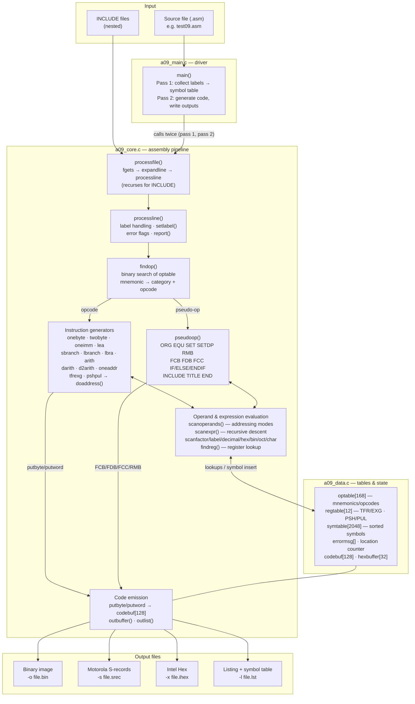

# A09 Motorola 6809 Cross-Assembler — System Architecture

Two-pass cross-assembler for the Motorola 6809, written in C (ISO/IEC 9899:2018 — C17).
Original by L.C. Benschop (1993/94), maintained by the sbc09 team, GPL v2. Intel Hex
output support and C17 modernization added in this fork.

Rendered diagram: `a09_system_diagram.png` (same architecture as the Mermaid source below).

---

## System Diagram



*(GitHub, GitLab, and VS Code render this Mermaid block automatically.)*

---

## Two-Pass Operation

| Pass | Purpose | Key behavior |
|---|---|---|
| **Pass 1** | Symbol collection | Every line is scanned; labels are inserted into the sorted `symtable` with their addresses. Forward references are tolerated (`unknown`/`certain` flags). Errors are counted and the user is asked whether to continue. |
| **Pass 2** | Code generation | The source is scanned again from a reset location counter; all symbols are now known, so operands resolve to final values. Machine code is emitted per line via `codebuf`, the listing is written, and the selected output format is produced with a proper end record (`S9...` or `:00000001FF`). |

## Module Map (three-file split)

| Module | Role | Highlights |
|---|---|---|
| `a09.h` | Shared header | Constants, `EXITEVAL`/`RESOLVECAT`/`RESTORE` macros, struct types, extern globals, all 50 prototypes |
| `a09_main.c` | Driver | `main()`: pass sequencing, file open modes (`"wb"` binary vs `"w"` text), end records |
| `a09_core.c` | Pipeline | Scanner, recursive-descent expression evaluator, addressing-mode analysis, 13 instruction-category generators, pseudo-ops, three output writers |
| `a09_data.c` | Tables & state | 168-entry opcode table, register table, 2048-slot symbol table, error messages, all global state |

The merged build (`a09.c`) contains the identical content in a single file; the two
builds produce **byte-identical** output.

## Data Flow Summary

1. **Read** — `processfile()` reads a line, `expandline()` expands tabs into `srcline`.
2. **Classify** — `processline()` takes an optional label, then `findop()` binary-searches the mnemonic: category 0–13 selects an instruction generator; category ≥ pseudo-op range dispatches to `pseudoop()`.
3. **Evaluate** — `scanoperands()` determines the 6809 addressing mode (immediate, direct, extended, indexed with pre/post inc/dec, PC-relative, indirect) and builds the postbyte; `scanexpr()` evaluates operand expressions by recursive descent, consulting/inserting into `symtable`.
4. **Emit** — `doaddress()`/`putbyte()`/`putword()` fill `codebuf`; `outbuffer()` routes the bytes to the active writer (raw binary, S-record with checksums, or Intel Hex with checksums); `outlist()` writes the annotated listing line.
5. **Finish** — after pass 2, the symbol table is appended to the listing and the format-specific end record is written.

## Command Reference

```
# build (merged)          gcc -std=c17 -Wall -Wextra -pedantic -o a09.exe a09.c
# build (split)           gcc -std=c17 -Wall -Wextra -pedantic -o a09.exe a09_data.c a09_core.c a09_main.c
# run (option order is fixed: output flag, then -l, then source)
a09.exe -o test.bin -l test.lst test09.asm
a09.exe -s test.srec test09.asm
a09.exe -x test.ihex test09.asm
```
